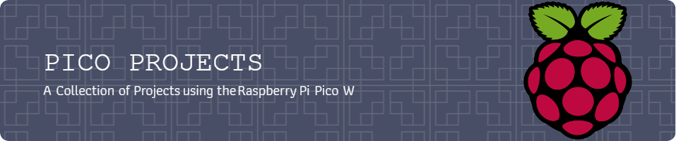

## Projects
This repository provides a collection of projects and resources regarding the [Raspberry Pi Pico W](https://www.raspberrypi.com/documentation/microcontrollers/raspberry-pi-pico.html).
Currently, the following write-ups exist:

- **[GitLab CI/CD Pipeline Status](./gitlab-pipeline-status)**: Visualize the status of the latest GitLab pipeline run using LEDs

## Toolkit
The projects are realized using the [Kepler Kit](https://docs.sunfounder.com/projects/kepler-kit/en/latest/).
This kit assembles several essential components (e.g., wires and resistors) but also contains additional sensors and actors.

## Resources
- [Official Datasheet](https://datasheets.raspberrypi.com/picow/pico-w-datasheet.pdf)
- [Official Guide: Networking and Bluetooth](https://datasheets.raspberrypi.com/picow/connecting-to-the-internet-with-pico-w.pdf)
- [YouTube Playlist](https://www.youtube.com/watch?v=SL4_oU9t8Ss&list=PLGs0VKk2DiYz8js1SJog21cDhkBqyAhC5) covering several components and applications
