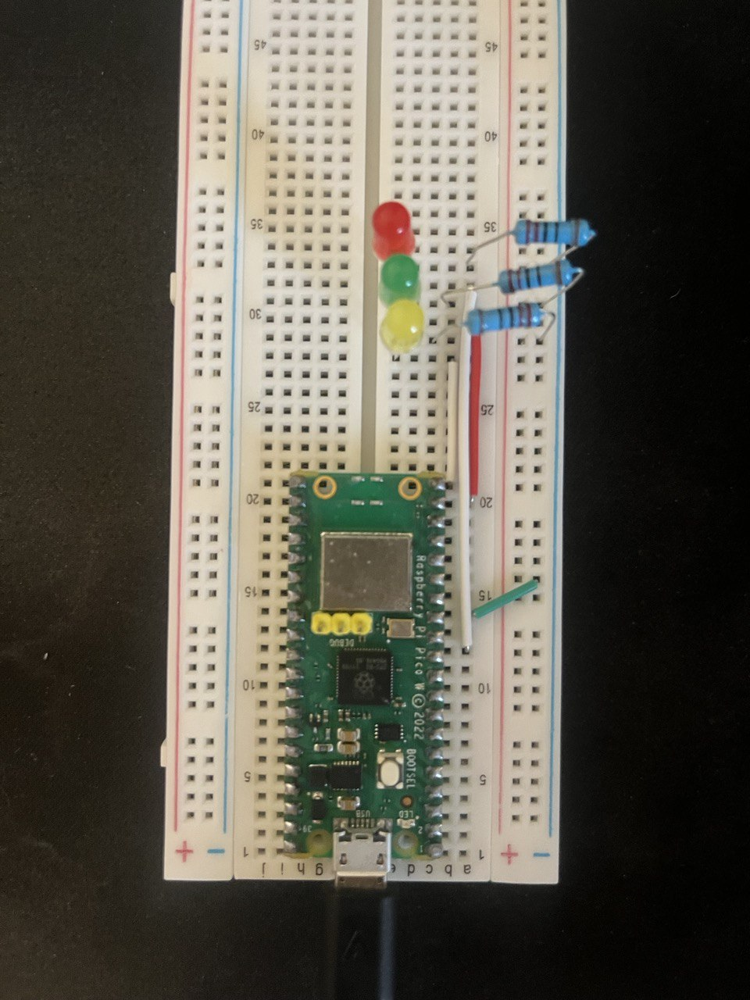

# GitLab CI/CD Pipeline Status

This project periodically fetches the latest GitLab CI/CD pipeline run and signals its status (e.g., idle, running, completed successfully, failed).
It performs the lookup using the [GitLab REST API](https://docs.gitlab.com/ee/api/pipelines.html#get-the-latest-pipeline).

## Demo

The following video shows the project live in action.

https://github.com/Paul2708/pico-projects/assets/12039677/538b0e59-d61c-4f8b-a355-f270c5766e28

## Hardware Setup

Based on the mentioned equipment kit, the following components are necessary:

- Raspberry Pi Pico W
- 3 LEDs
- 3 x 220 Ohm resistors

The setup consists of three circuits.
Each circuit uses a GPIO (General Purpose Input/Output) pin as a power supply, connects to an LED and a consistor, and settles to the ground (GND).

## Software Setup

Based on the initial and already mentioned Thonny setup, the following source files are required:

- **[main.py](./code/main.py)**: It runs the application.
- **[secrets.py](./code/example.secrets.py)**: It contains credentials and sensitive information.

**Installation:**

1. Rename `example.secrets.py` to `secrets.py` and adjust the values.
2. Store both files in the same directory on the Pico.
3. Run the file `main.py`.

Now, the LED should visualize the idle mode. 
If a pipeline gets executed, the LED mode switches after a maximum of 10 seconds by blinking the yellow LED.
If the pipeline is completed, the green or red LED lights up for approximately one minute.
After that, the LEDs are back in idle mode and waiting for the subsequent execution.

## Lessons Learned
- Basic circuit to power an LED
- Importance of a resistor in this circuit
- The reason why the order of series connection is independent ([reference](https://www.youtube.com/watch?v=NUKD9qESO58))
  - The amperage stays the same in a series connection, and only the voltage drops at the resistor.
  - A specific amperage value must be met to avoid burning the LED.
- There is no non-blocking implementation of the module `urequests` as discussed [here](https://github.com/micropython/micropython-lib/issues/550).
Therefore, the LEDs pause while the HTTP request is made.
